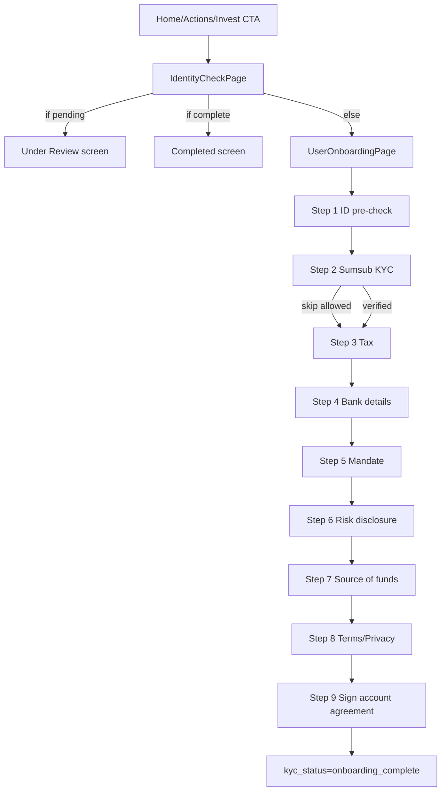

# Onboarding System Documentation

## Summary

This codebase has **two different concepts named onboarding**:

1. **Welcome/Auth onboarding** (`OnboardingPage`) for account creation/login.
2. **Identity + compliance onboarding** (`UserOnboardingPage`) for KYC and investment readiness.

This document covers #2 (identity/compliance onboarding), and how it connects to the app’s “Quick Actions” equivalent UI (`Outstanding actions` on Home + `Actions` page).

---

## High level overview

## What onboarding is meant to do

The onboarding flow is the compliance and account-readiness workflow required before investing. It combines:

- ID pre-check
- Sumsub KYC verification
- tax capture
- bank details capture
- mandate acceptance
- risk disclosure acceptance
- source-of-funds declaration
- terms acceptance
- signed account agreement PDF

Primary owner: `src/pages/UserOnboardingPage.jsx` + `src/components/AccountAgreementStep.jsx`.

## Who goes through onboarding

Authenticated users who try to access gated investment actions (buy/invest) or users opening the Actions/Identity Check flow.

## When onboarding appears

Typical triggers:

- User taps **Outstanding action: Complete onboarding** on Home (`HomePage` → `routeName: "actions"`), then enters `IdentityCheckPage`, then `UserOnboardingPage`.
- User taps **Complete onboarding** on `ActionsPage` (`navigateTo: "identityCheck"`).
- User tries to invest/buy from stock/factsheet and fails `checkOnboardingComplete()`; modal sends to onboarding (`onNavigateToOnboarding`).

## When a user is considered onboarded

Canonical completion is computed as:

- KYC complete (`kyc_status` is `approved` / `verified` / `onboarding_complete`) **AND**
- all financial flags present (`tax_details_saved`, `bank_details_saved`, mandate accepted, risk accepted, SOF accepted, terms accepted)

This is implemented in both client and API `parseOnboardingFlags` logic.

`kyc_status === "onboarding_complete"` is treated as definitive completion and sets all flags true logically.

## Mandatory, partial, branches

- The UX allows partial progress and resume.
- KYC step allows **“Skip for now”** in `UserOnboardingPage` step 2.
- However, investment gating uses full completion (`is_fully_onboarded`) from `/api/onboarding/status`.
- There is no explicit multi-branch flow type; there are conditional input sections (employment/student sections, SOF “other” field).

---

## Entry points into onboarding

## Route-level entry points

### 1) `identityCheck` app page
- **File**: `src/App.jsx`
- **Trigger**: navigation to `currentPage === "identityCheck"`
- **Component**: `IdentityCheckPage`
- **Destination behavior**: may render completion card, pending-review card, or full `UserOnboardingPage`.

### 2) direct `userOnboarding` app page
- **File**: `src/App.jsx`
- **Trigger**: `currentPage === "userOnboarding"`
- **Component**: `UserOnboardingPage`
- **Note**: appears as an internal path, not the primary user path.

## CTA/button entry points

### 3) Home “Outstanding actions” card
- **File**: `src/pages/HomePage.jsx`
- **Logic**:
  - builds `actionsData` with single onboarding action (`id: "onboarding"`, `title: "Complete onboarding"`, `routeName: "actions"`)
  - shows when not complete (`!identityFullyComplete`)
- **Click result**: `handleActionNavigation` routes to `onOpenActions()`.

### 4) Actions page “Complete onboarding” item
- **File**: `src/pages/ActionsPage.jsx`
- **Logic**:
  - constructs one action, `navigateTo: "identityCheck"`
  - only in outstanding list if `!allOnboardingComplete`
- **Click result**: `onNavigate("identityCheck")`.

### 5) Investment gating modals

#### Stock detail buy gating
- **File**: `src/pages/StockDetailPage.jsx`
- **Logic**: Buy button checks `await checkOnboardingComplete()`.
- **If false**: shows modal with “Complete Onboarding” button.
- **Click**: invokes `onNavigateToOnboarding` from `App` (mapped to `navigateTo("identityCheck")`).

#### Factsheet invest gating
- **File**: `src/pages/FactsheetPage.jsx`
- **Logic**: Invest button checks `await checkOnboardingComplete()`.
- **If false**: shows modal with onboarding CTA.
- **Click path**: via prop from `App` to `navigateTo("identityCheck")`.

## Auth-based and resume behavior

- `UserOnboardingPage` loads existing auth user and onboarding record on mount.
- It fetches `/api/onboarding/status` and latest `user_onboarding` row, then hydrates local flags (`taxDone`, `bankDone`, `mandateDone`, etc.).
- Navigation uses `getNextIncompleteStep()` and `getPrevIncompleteStep()` to resume and skip already-complete steps.

---

## Full onboarding flow

## Step sequence (9 steps)

Owned in `src/pages/UserOnboardingPage.jsx`:

0. Intro (“First time onboarding process”)
1. Identity Check (SA ID number uniqueness check)
2. Identification (Sumsub KYC)
3. Tax Information
4. Bank Account Details
5. Discretionary FSP Mandate
6. Risk Disclosure
7. Source of Funds
8. Contract Agreement (terms/privacy checkboxes)
9. Account Agreement signature flow (`AccountAgreementStep`)

## Step-by-step details

### Step 1: Identity Check
- **Fields**: `identityNumber` (13 digits).
- **Validation**: regex `^\d{13}$`.
- **Submit**: POST `/api/onboarding/check-id-number` with bearer token.
- **Outcome**:
  - if ID exists in onboarding pack data, shows masked email error.
  - if clear, ensures onboarding row exists (via `/api/onboarding/save-employment`) then advances.

### Step 2: Identification (KYC)
- **Component**: `SumsubVerification`.
- **Behavior**:
  - obtains Sumsub access token from `/api/sumsub/access-token`.
  - mounts Sumsub SDK widget.
  - “Skip for now” available.
  - “Continue” appears when verified (`showProceed`) or KYC already verified.
- **Notes**:
  - global polling pause/resume is used while widget mounted (`pauseSumsubPolling` / `resumeSumsubPolling`).

### Step 3: Tax Information
- **Field**: tax reference number.
- **Validation**: button enabled at min length > 5 (placeholder says 10-digit; no strict 10-digit validator).
- **Submit**: `saveProgressFlag("tax_details_saved", { tax_details... })` updates `sumsub_raw`.

### Step 4: Bank details
- **Fields**: bank name, account holder name, account type, account number, branch code.
- **Validation**: all required via `bankDetailsReady`.
- **Submit**:
  - updates top-level columns in `user_onboarding` (bank_name, bank_account_number, bank_branch_code).
  - also writes `sumsub_raw.bank_details` + `bank_details_saved` flag.

### Step 5: Mandate
- **UI**: `MandateViewer` with profile-dependent completeness checks.
- **Gate**: checkbox + mandate validity.
- **Submit**: `saveProgressFlag("mandate_accepted")`; final completion also POSTs `/api/onboarding/save-mandate`.

### Step 6: Risk disclosure
- **Gate**: `agreedRiskDisclosure` checkbox.
- **Submit**: `saveProgressFlag("risk_disclosure_accepted")`.

### Step 7: Source of funds
- **Fields**: source, optional “other”, expected monthly investment, declaration checkbox.
- **Gate**: `sofReady` true.
- **Submit**: `saveProgressFlag("source_of_funds_accepted")`.

### Step 8: Contract agreement
- **Fields**: terms checkbox + privacy checkbox.
- **Gate**: both checked (`agreementReady`).
- **Submit**: `saveProgressFlag("terms_accepted")`.

### Step 9: Account agreement signing
- **Component**: `src/components/AccountAgreementStep.jsx`.
- **Phases**: review → sign → processing → success.
- **Data operations**:
  - generates signed PDF (`jsPDF`), captures signature image.
  - uploads PDF via `/api/onboarding/upload-agreement` (server route).
  - updates `user_onboarding` with `kyc_status: "onboarding_complete"` and stamps signing fields in `sumsub_raw` (`signed_at`, `downloaded_at`, `signed_agreement_url` etc).
  - triggers `/api/onboarding/complete` as additional server sync.

## Navigation, skipping, and resume

- Forward progression uses `getNextIncompleteStep(afterStep, justCompletedStep)`.
- Back navigation uses `getPrevIncompleteStep(beforeStep)`.
- Resume is inferred by reading existing DB flags on mount and skipping completed steps.
- KYC can be skipped temporarily, but full completion is still required for invest-gated features.

## Mermaid: onboarding flow



---

## Data model and persistence

## Frontend state and hooks

- `UserOnboardingPage` local React state for step and field values.
- `useSumsubStatus` for KYC status (`verified/pending/needs_resubmission/not_verified`) with polling and cache.
- `checkOnboardingComplete()` utility for gate checks from investment screens.
- `HomePage` stores `onboardingComplete` + `onboardingChecked` local state.

## Backend/API data stores

### `user_onboarding` table (primary onboarding row)
Observed columns used in code:

- IDs/identity: `id`, `user_id`, `kyc_status`, `created_at`
- KYC metadata: `sumsub_external_user_id`, `sumsub_applicant_id`, `sumsub_review_status`, `sumsub_review_answer`, `kyc_checked_at`, `kyc_verified_at`
- Employment: `employment_status`, `employer_name`, `employer_industry`, `employment_type`, `institution_name`, `course_name`, `graduation_date`, `annual_income_amount`, `annual_income_currency`
- Bank columns: `bank_name`, `bank_account_number`, `bank_branch_code`
- Signing/download: `downloaded_at`
- JSON payload: `sumsub_raw` (step flags and rich payload)

### `sumsub_raw` JSON field
Used as step-progress envelope. Keys seen:

- `tax_details_saved`, `tax_details`
- `bank_details_saved`, `bank_details`
- `mandate_data`, `mandate_accepted`
- `risk_disclosure_accepted`
- `source_of_funds_accepted`
- `terms_accepted`
- `signed_at`, `downloaded_at`, `signed_agreement_url`

### `required_actions` table (related)
Used for status bits that influence other UX paths, including KYC/bank:

- `kyc_verified`, `kyc_pending`, `kyc_needs_resubmission`
- `bank_linked`, `bank_in_review`

### `user_onboarding_pack_details` table
Stores Sumsub/pack payload and also powers ID pre-check and short-circuit verified detection in `/api/sumsub/status`.

## API endpoints involved

- `/api/onboarding/status` (GET): returns latest onboarding + computed `is_fully_onboarded` (and flags in API route version).
- `/api/onboarding/complete` (POST): marks `kyc_status` as `onboarding_complete`, merges bank/tax details.
- `/api/onboarding/save-mandate` (POST): persists mandate payload into `sumsub_raw`.
- `/api/onboarding/check-id-number` (POST): validates ID against `user_onboarding_pack_details` and returns `exists` + masked email.
- `/api/sumsub/access-token` (POST): creates/uses Sumsub applicant and returns SDK token.
- `/api/sumsub/status` (POST): computes KYC status, updates onboarding/required_actions, stores verified pack details.

## Needs confirmation: endpoint source duplication

`UserOnboardingPage` calls `/api/onboarding/save-employment` and `/api/onboarding/upload-agreement`, but those endpoints are present in `server/index.cjs` and not in `api/onboarding/*` folder. This suggests runtime-dependent API surface (Express server vs serverless API routes).

---

## Business logic that determines onboarding status

## Canonical completion logic

`parseOnboardingFlags` (client and API versions) computes:

- `kycDone` if `kyc_status` in `approved | verified | onboarding_complete`
- step flags from `sumsub_raw` unless `kyc_status === onboarding_complete`
- `allComplete = kycDone && taxDone && bankDone && mandateAgreed && riskDone && sofDone && termsDone`

Precedence:

1. `onboarding_complete` => all complete immediately (hard override)
2. else if KYC done + `sumsub_raw.signed_at` => all complete
3. else evaluate each step flag individually

## KYC status state machine (`/api/sumsub/status`)

KYC-specific states:

- `verified`
- `pending`
- `needs_resubmission`
- `not_verified`

Decision precedence (simplified):

1. Pack record exists → verified shortcut.
2. All docs green + review GREEN → verified.
3. Rejected / onHold / incomplete+submitted / not-all-green → needs_resubmission.
4. Pending/queued or submitted-no-incomplete → pending.
5. Else not_verified.

Also updates `user_onboarding` and `required_actions` when verified.

## Not started / in progress / complete mapping

- **Not started**: no onboarding row and/or status `not_verified`, no flags.
- **In progress**: any partial flags set or KYC pending/resubmission; not `allComplete`.
- **Completed**: `is_fully_onboarded === true` from onboarding status endpoint (usually `onboarding_complete` or equivalent full flag set).

Blocked/pending-type UX states exposed in UI:

- Under review (`kycPending`)
- Documents required (`kycNeedsResubmission`)

---

## Quick Actions integration

> In this codebase, “Quick Actions” appears to be implemented as the **Outstanding actions** card carousel on Home and the dedicated **Actions** page, not as a literal `QuickActions` component.

## Where actions are defined

### Home page action model
- **File**: `src/pages/HomePage.jsx`
- `actionsData` currently contains one onboarding item.
- Derived booleans:
  - `identityFullyComplete = kycVerified && onboardingComplete`
- Action visibility:
  - shown in `OutstandingActionsSection` if `!isComplete` and `onboardingChecked` true.

### Actions page action model
- **File**: `src/pages/ActionsPage.jsx`
- Builds `allActions` with one onboarding action.
- Status label/description are dynamic from KYC + onboarding flags.
- Click navigates to `identityCheck`.

## Onboarding action details

| Surface | Label | Icon | Click action | Show condition | Hide condition |
|---|---|---|---|---|---|
| Home Outstanding actions | Complete onboarding | `ShieldCheck` | routeName `actions` via `onOpenActions` | `onboardingChecked && !identityFullyComplete` | `identityFullyComplete` |
| Actions page | Complete onboarding | `FileText` | `navigateTo: "identityCheck"` | `!allOnboardingComplete` | `allOnboardingComplete` |

### Dynamic statuses shown

Home uses:

- Verified
- Documents Required
- Under Review
- Continue Onboarding
- Action Required

Actions page uses:

- Complete
- Documents Required
- Under Review
- Action Required
- Required

## Ordering/prioritization

- Home: explicit `priority: 1` in onboarding action object (currently only one action).
- Outstanding actions component slices first three (`actions.slice(0, 3)`).

## Unlock behavior

- Completing onboarding removes onboarding action from both Home and Actions page.
- Investment features are unlocked by checks against `checkOnboardingComplete()` / `/api/onboarding/status`.

---

## What influences what

## Dependency table

| Source condition/field | Where it lives | Affects | UI result | Notes |
|---|---|---|---|---|
| Auth session token | Supabase auth + API bearer auth | Onboarding API access | Missing/invalid token => onboarding API failures | Many endpoints return 401 on missing token |
| `kyc_status` | `user_onboarding.kyc_status` | completion logic | `onboarding_complete` treated as definitive complete | Used in parse flags + status APIs |
| `sumsub_raw.*` flags | `user_onboarding.sumsub_raw` | completion logic and resume | step badges/continue paths and final `allComplete` | stores granular progress |
| `useSumsubStatus().kycPending` | hook + `/api/sumsub/status` | Home/Actions/IdentityCheck text | “Under Review” statuses; pending screen in IdentityCheck | polled every 30s |
| `useSumsubStatus().kycNeedsResubmission` | same | Home/Actions statuses | “Documents Required” | driven by Sumsub review outcomes |
| `is_fully_onboarded` | `/api/onboarding/status` | invest gating checks | show onboarding modal on Factsheet/StockDetail | consumed by `checkOnboardingComplete` |
| `onboardingChecked` | Home local state | Home card visibility | avoids rendering action before check completes | prevents premature UI |
| `required_actions` row | DB + `useRequiredActions` | related status/notifications | bank-link and KYC notifications | not the direct completion flag |
| pack details existence | `user_onboarding_pack_details` | Sumsub status API short-circuit | immediate verified in `/api/sumsub/status` | also used in ID duplication check |

## Mermaid dependency diagram

```mermaid
flowchart LR
  A[Supabase Auth Session] --> B[/api/onboarding/status]
  A --> C[/api/sumsub/status]
  C --> D[useSumsubStatus hook]
  B --> E[checkOnboardingComplete]
  B --> F[Home onboardingComplete]
  D --> F
  D --> G[ActionsPage status/description]
  F --> H[Outstanding actions visibility]
  E --> I[Stock/Factsheet invest gating]
  J[user_onboarding sumsub_raw flags] --> B
  K[user_onboarding kyc_status] --> B
  L[user_onboarding_pack_details] --> C
```

---

## Related systems connected to onboarding

- **Authentication**: all onboarding API routes require bearer token and user resolution.
- **Profile** (`useProfile`): mandate step validates missing profile fields; account agreement auto-populates profile data in PDF.
- **Sumsub KYC**: `SumsubVerification` + `/api/sumsub/*` endpoints drive identity status.
- **Required actions subsystem**: keeps KYC/bank bits and emits notifications.
- **Investment gates**: `StockDetailPage` and `FactsheetPage` block buy/invest until onboarding complete.
- **Credit flow**: `CreditApplyPage` can read/write employment info to `user_onboarding`.
- **Realtime subscriptions**: `HomePage` listens to `user_onboarding` and `required_actions` table changes to refresh action states.

---

## Backend/API behavior

## `/api/onboarding/status`

- Authenticates user by bearer token.
- Reads latest `user_onboarding` row.
- Computes `is_fully_onboarded` from KYC+flags.
- Returns `onboarding_id` and onboarding data (API-route version strips `sumsub_raw` in response payload copy).

## `/api/onboarding/complete`

- Authenticates user.
- Upserts/updates `required_actions.kyc_verified` (non-critical on failure).
- Finds existing onboarding row or creates one.
- Sets `kyc_status: onboarding_complete`.
- Optionally merges bank/tax details into `sumsub_raw`.

## `/api/onboarding/save-mandate`

- Authenticates user.
- Updates/inserts onboarding row.
- Merges `mandate_data` into `sumsub_raw`.

## `/api/onboarding/check-id-number`

- Authenticates user.
- Validates 13-digit ID.
- Scans `user_onboarding_pack_details.pack_details` recursively.
- Returns existence and masked profile email if found.

## `/api/sumsub/status`

- Authenticates through userId in body (not bearer-only path).
- Calls Sumsub applicant and required-doc APIs.
- Computes KYC state.
- On verified, persists pack details and updates `user_onboarding` + `required_actions`.

## `/api/sumsub/access-token`

- Creates applicant (ignores “already exists” case), then generates SDK token.

## Needs confirmation: upload endpoint location

`AccountAgreementStep` posts to `/api/onboarding/upload-agreement`. In this repo, this route appears in `server/index.cjs` but not in `api/onboarding/` serverless folder.

---

## UI conditions and rendering logic

## Where onboarding UI decisions are made

- `IdentityCheckPage` branches:
  - loading spinner while checking
  - completed screen if `kycVerified && onboardingComplete`
  - pending screen if `kycPending`
  - otherwise full `UserOnboardingPage`

- `HomePage` action card rendered only after onboarding check, and only for incomplete action.

- `ActionsPage` shows either “All done” or outstanding/completed sections.

## Client vs server decision split

- Server-computed: `is_fully_onboarded`, KYC status classification.
- Client-computed: local labels/descriptions, step UI progression, fallback completion checks.

## Loading / fallback / race handling

- Home onboarding check tries API first then direct Supabase fallback.
- `checkOnboardingComplete()` uses same API-first fallback pattern.
- Realtime subscriptions refresh onboarding and required_actions.
- Sumsub polling has cache and pause mechanism to reduce duplicate polling while widget active.

---

## Edge cases and failure modes

| Edge case | Current handling |
|---|---|
| User closes flow mid-way | progress flags persist in `sumsub_raw`; loadExistingOnboarding rehydrates local state |
| Missing auth token | onboarding endpoints return 401; UI sets generic errors or non-auth state |
| API unreachable | Home and utility checks fall back to direct Supabase read |
| Missing onboarding row | endpoints attempt insert; `save-mandate` and `complete` can create row |
| KYC verified but onboarding incomplete | Home/Actions show continue-required statuses |
| Stale UI state | realtime subscriptions on `user_onboarding`/`required_actions` trigger refresh |
| Duplicate notification events | `useSumsubStatus` localStorage lock + debounce in `useRequiredActions` |
| Endpoint mismatch (`save-employment`, `upload-agreement`) | Works only if Express server routes are active; **Needs confirmation** for serverless-only runtime |
| User marked complete but KYC later “verified” webhook | server logic preserves `onboarding_complete` and avoids overwrite |
| Partial validation mismatch | Tax field placeholder says 10-digit, but button allows length >5 (inconsistent rule) |

---

## Developer walkthrough

## Read these files first

1. `src/pages/UserOnboardingPage.jsx` (step orchestration and state)
2. `src/components/AccountAgreementStep.jsx` (final signing + completion writes)
3. `src/lib/checkOnboardingComplete.js` (completion rule helper)
4. `api/onboarding/status.js` and `api/sumsub/status.js` (server-side status logic)
5. `src/pages/HomePage.jsx` + `src/pages/ActionsPage.jsx` (Quick Actions integration)

## Where to change onboarding steps

- Main step sequence and rendering: `UserOnboardingPage.jsx`
- Final agreement/signing behavior: `AccountAgreementStep.jsx`

## Where to change Quick Actions logic

- Home card action config: `HomePage.jsx` (`actionsData`)
- Actions list and labels: `ActionsPage.jsx` (`allActions`, status/description helpers)
- Card rendering: `OutstandingActionsSection.jsx`

## Where to change completion rules

- Client completion parser: `src/lib/checkOnboardingComplete.js`
- API completion parser: `api/onboarding/status.js`
- Express variant: `server/index.cjs` `/api/onboarding/status`

## Where to debug incorrect onboarding visibility

- Start with `/api/onboarding/status` response and `flags`.
- Inspect latest `user_onboarding` row (`kyc_status`, `sumsub_raw`).
- Check `useSumsubStatus` output (`kycPending`, `kycNeedsResubmission`, `kycVerified`).
- Confirm route wiring in `App.jsx` (`actions` → `identityCheck`).

---

## Recommended improvements

1. **Unify duplicated completion logic** (`parseOnboardingFlags`) into shared package used by both client and all backend surfaces.
2. **Unify API surface** for onboarding routes; avoid split between `api/*` and `server/index.cjs` implementations, especially for `save-employment` and `upload-agreement`.
3. **Configuration-driven action registry** for Home/Actions so onboarding and future actions are declared once.
4. **Stronger validation consistency** (e.g., tax number exact length if required).
5. **Explicit onboarding status enum** (`not_started`, `in_progress`, `completed`) persisted server-side to simplify UI logic.
6. **Add end-to-end tests** for state transitions:
   - KYC pending → verified
   - verified + missing flags
   - completed signature path
   - stale action card removal after completion.
7. **Observability**: add structured logging/event tracing for each onboarding step save and final completion write.
8. **Document runtime expectations** for which server handles which endpoint in deployment environments.

---

## Appendix A: file map / references

### Core onboarding UI
- `src/pages/UserOnboardingPage.jsx`
- `src/components/AccountAgreementStep.jsx`
- `src/components/SumsubVerification.jsx`
- `src/pages/IdentityCheckPage.jsx`

### Quick Actions integration
- `src/pages/HomePage.jsx`
- `src/components/OutstandingActionsSection.jsx`
- `src/pages/ActionsPage.jsx`

### Completion/status utilities
- `src/lib/checkOnboardingComplete.js`
- `src/lib/useSumsubStatus.js`
- `src/lib/useRequiredActions.js`

### Backend APIs
- `api/onboarding/status.js`
- `api/onboarding/complete.js`
- `api/onboarding/save-mandate.js`
- `api/onboarding/check-id-number.js`
- `api/sumsub/status.js`
- `api/sumsub/access-token.js`

### Express server equivalents / extra onboarding routes
- `server/index.cjs` (contains `save-employment`, `upload-agreement`, `complete`, `status`, etc.)

---

## Appendix B: state matrix

| KYC status (hook/API) | Onboarding flags complete? | Home Outstanding action | Actions page onboarding action | Invest/Buy gating |
|---|---|---|---|---|
| `not_verified` | no | shown (“Action Required”) | shown | blocked |
| `pending` | no | shown (“Under Review”) | shown | blocked |
| `needs_resubmission` | no | shown (“Documents Required”) | shown | blocked |
| `verified` | no | shown (“Continue Onboarding” or required text) | shown | blocked |
| `verified` + all flags complete | yes | hidden | completed section | unblocked |
| `onboarding_complete` | yes (override) | hidden | completed section | unblocked |

